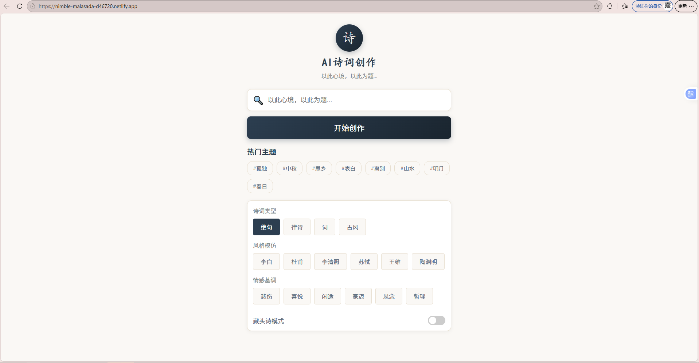

# 🎋 AI 诗词创作助手

[](https://app.netlify.com/sites/nimble-malasada-d46720/deploys) <!-- 如果你有 Netlify Badge 可以填上 ID -->

一个基于 Web 的 AI 古诗词创作工具。用户可以指定主题、类型（绝句/律诗/词）、风格（如李白/苏轼）以及情感基调，由 AI 生成原创古诗词。

✨ **在线体验**：[点击这里访问应用](https://nimble-malasada-d46720.netlify.app)

---

## 📸 截图预览

<!-- 如果你有截图，可以在这里放一张 -->


## ✨ 核心功能

-   **主题创作**：输入任意主题（如“中秋”、“山水”），AI 即时生成诗词。
-   **藏头诗模式**：开关切换，支持生成趣味藏头诗。
-   **风格模仿**：可选模仿李白、杜甫、苏轼、李清照等名家风格。
-   **情感控制**：指定“喜悦”、“悲伤”、“豪迈”等情感色彩。
-   **一键复制**：生成后可直接复制到剪贴板分享。
-   **历史记录**：本地存储最近的创作，方便回顾。

## 🛠️ 技术栈

-   **前端**：原生 HTML5, CSS3 (Flexbox + 动画), Vanilla JavaScript (ES6+)
-   **AI 引擎**：阿里云通义千问 (`qwen-plus`)
-   **部署平台**：Netlify / Vercel
-   **状态管理**：基于 `localStorage` 的轻量级历史记录存储

## 🚀 快速开始

### 1. 本地运行

如果你想在本地运行该项目：

1.  克隆仓库：
    ```bash
    git clone https://github.com/dengxiangrui/http-AI-poet-program-pro-.git
    ```
2.  进入目录：
    ```bash
    cd http-AI-poet-program-pro-
    ```
3.  直接打开 `index.html` 即可（注意：部分浏览器可能因跨域限制无法调用 API，建议使用本地服务器）：
    ```bash
    # 使用 Python 快速启动
    python -m http.server 8000
    ```

### 2. 部署到你的 Netlify/Vercel

1.  点击 Netlify/Vercel 的 "New Site from Git"。
2.  选择本仓库。
3.  **配置发布目录**：`web`
4.  构建命令留空。
5.  点击部署。

## 🔐 环境配置 (重要)

**⚠️ 安全警告：** 为了防止 API Key 泄露导致费用损失，请务必配置环境变量。

1.  在 `api.js` 中，不要硬编码 Key，应使用环境变量（在 Netlify/Vercel 后台设置）：
    ```javascript
    // api.js
    const config = {
        API_KEY: process.env.DASHSCOPE_API_KEY || '你的临时测试key(不推荐)',
        // ...
    };
    ```
2.  在 Netlify/Vercel 的项目设置中，添加环境变量：
    -   Key: `DASHSCOPE_API_KEY`
    -   Value: `sk-你的实际密钥`

## 📂 项目结构

```text
├── index.html          # 主页面结构
├── style.css           # 样式文件 (中国风设计)
├── app.js              # 核心业务逻辑 (状态管理、DOM 操作)
├── api.js              # AI 接口请求封装
└── README.md           # 项目说明
